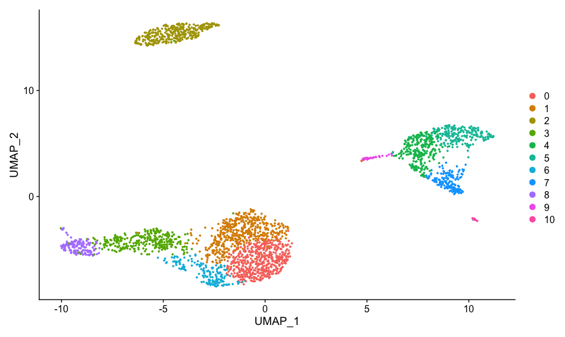
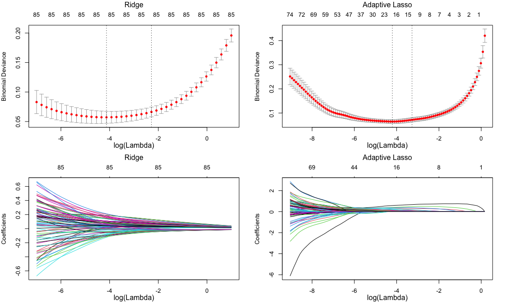

# alDFC

DFC extraction with Adaptive Lasso

## What’s this for ?

Characterizing cell populations with 
1. too many differentially expessed genes (DEG) due to the statistical high sensitivity of single cell data.
2. no clear characteristic genes.

This R package `alDFC` is dedicated for the purpose, and extract a small gene subset characterizing target cell populations with discriminative method.

Please see also [*Discriminative feature of cells characterizes cell populations of interest by a small subset of genes. (Fujii and Maehara et. al. PLOS Comput. Biol. 2021)*](https://journals.plos.org/ploscompbiol/article?id=10.1371/journal.pcbi.1009579)

## Installation

`install.packages("devtools")` if you haven"t installed it.

Then run,

``` r
devtools::install_github("tfwis/alDFC")
```

## The workflow

* Step1: Perform single cell data analysis and find target cell cluster
* Step2: Characterize target cell cluster by discrimination
* Step3: Classify DFC set into 3 groups; *Strong*, *Weak* or *Niche*

## Tutorial

### 1. Set target clusters

Perform preprocesssing and standard analysis. Here, following [Seurat tutorial](https://satijalab.org/seurat/articles/pbmc3k_tutorial.html). The sample data was also provided in the tutorial.

If you are not `Seurat` user, please create scaled data matrix, extract clusters and set target clusters.

```r
library(Seurat)
pbmc.data <- Read10X(data.dir="filtered_gene_bc_matrices/hg19/")
pbmc <- CreateSeuratObject(counts=pbmc.data, project="pbmc3k", min.cells=3, min.features=200)
pbmc <- NormalizeData(pbmc)
pbmc <- ScaleData(pbmc)
pbmc <- FindVariableFeatures(pbmc, nfeatures=2000)
pbmc <- RunPCA(pbmc, features=VariableFeatures(pbmc))
pbmc <- FindNeighbors(object=pbmc)
pbmc <- FindClusters(pbmc)
pbmc <- RunUMAP(pbmc, dims=1:10)
DimPlot(pbmc, reduction="umap")
```



Here, set cluster8 as target cluster.

### 2. DFC extraction

### 2.1. With `Seurat`

Using `Seurat` object and target number, `dfc()` function extract DFC subset. 

```r
library(alDFC)
dfc_res <- dfc(pbmc, target_clusters=8, return_Model=TRUE)
```

`target_cluster` can be given a vector; `c(3,8)`

### 2.2. Without `Seurat`

Convert your data into `matrix` class. Then run,

```r
library(alDFC)
dfc_res <- dfc(mat, target_clusters=8, clsuter_label, return_Model = TRUE)
```

`mat` is your data matrix.
`cluster_label` is a vector of the cluster names for each cell.

The solution path plots and the cross varidation results of each model are checked as follows.

```r
layout(matrix(1:4,ncol=2))

par(mar=c(3.5, 4, 3.5, 2))
plot(dfc_res[["Ridge"]], xlab="")
mtext(side=3, text="Ridge", line=2.3)
mtext(side=1, text="log(Lambda)", line=2)

par(mar=c(3.5, 4, 3.5, 2))
plot(dfc_res[["Ridge"]]$glmnet.fit, xvar="lambda", xlab="")
mtext(side=3, text="Ridge", line=2.3)
mtext(side=1, text="log(Lambda)", line=2)

par(mar=c(3.5, 4, 3.5, 2))
plot(dfc_res[["AdaLasso"]], xlab="")
mtext(side=3, text="Adaptive Lasso", line=2.3)
mtext(side=1, text="log(Lambda)", line=2)

par(mar=c(3.5, 4, 3.5, 2))
plot(dfc_res[["AdaLasso"]]$glmnet.fit, xvar ="lambda", xlab="")
mtext(side=3, text="Adaptive Lasso", line=2.3)
mtext(side=1, text="log(Lambda)", line=2)
```



### 3. DFC classification

Features in DFC subset are classified into about three groups; *Strong*, *Weak* or *Niche* feature. `dfc_classify()` function is for the classification.

```r
## Seurat
dfc_class <- dfc_classify(pbmc,dfc_res)

## Other
dfc_class <- dfc_classify(mat,dfc_res,cluster_label)
```

## Advanced options

### Sure independence screening (SIS)

Single cell data analysis using adaptive lasso has high computational cost and takes long computational time . To reduce them, alDFC has *Sure independence screening* (SIS) implemented. In default, SIS is performed before adaptive lasso. To obtain unscreened result, please set `SIS = FALSE`.

